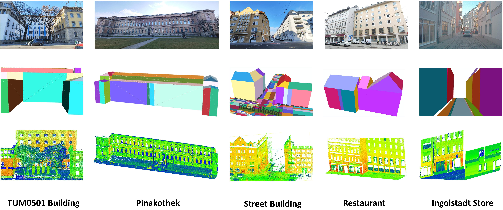
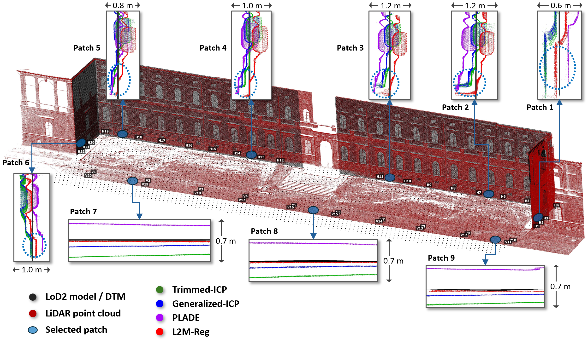

# [ISPRS, 2026]L2M-Reg: Building-level Uncertainty-aware Registration of Outdoor LiDAR Point Clouds and Semantic 3D City Models

> 🚧 **Status: Under construction.**  
> Code and data are being organized and will be released very soon!

## Overview

**L2M-Reg** is a building-level fine registration method between outdoor **LiDAR point clouds** and **semantic 3D city models (LoD2)** that explicitly accounts for **model generalization uncertainty**. It is designed as a reliable prerequisite for **urban digital twinning** tasks such as digital construction, change detection, and model refinement.  
**Authors**: [Ziyang Xu](https://www.asg.ed.tum.de/gds/xu/) · [Benedikt Schwab](https://www.asg.ed.tum.de/en/gis/our-team/staff/benedikt-schwab/) · [Yihui Yang](https://www.asg.ed.tum.de/gds/team/yihui-yang/) · [Thomas H. Kolbe](https://www.asg.ed.tum.de/en/gis/our-team/staff/prof-thomas-h-kolbe/) · [Christoph Holst](https://www.asg.ed.tum.de/gds/holst/)  
**Affiliation**: [Chair of Engineering Geodesy, Technical University of Munich](https://www.asg.ed.tum.de/gds/home/), [Chair of Geoinformatics, Technical University of Munich](https://www.asg.ed.tum.de/en/gis/home/)

<figure align="center">
  
  <figcaption><b>Figure 1.</b> The proposed L2M-Reg. Each plane of the input semantic LoD2 model is colored for better visualization, and the point cloud is colored by intensity.</figcaption>
</figure>

---

## Abstract
Accurate registration between LiDAR (Light Detection and Ranging) point clouds and semantic 3D city models is a fundamental topic in urban digital twinning and a prerequisite for downstream tasks, such as digital construction, change detection, and model refinement. However, achieving accurate LiDAR-to-Model registration at the individual building level remains challenging, particularly due to the generalization uncertainty in semantic 3D city models at the Level of Detail 2 (LoD2). This paper addresses this gap by proposing L2M-Reg, a plane-based fine registration method that explicitly accounts for model uncertainty. L2M-Reg consists of three key steps: establishing reliable plane correspondence, building a pseudo-plane-constrained Gauss-Helmert model, and adaptively estimating vertical translation. Overall, extensive experiments on five real-world datasets demonstrate that L2M-Reg is both more accurate and computationally efficient than current leading ICP-based and plane-based methods. Therefore, L2M-Reg provides a novel building-level solution regarding LiDAR-to-Model registration when model uncertainty is present.

---

## Key Contributions

- A plane-based LiDAR-to-Model fine registration method, L2M-Reg, tailored for individual buildings is proposed. It integrates reliable plane correspondence establishment, pseudo-plane-constraint Gauss-Helmert Model (GHM), and adaptable vertical translation estimation. By explicitly considering the uncertainty in LoD2 models, L2M-Reg achieves superior performance on all five real-world datasets.
- A 2D-3D decoupled transformation parameter estimation strategy is introduced to mitigate the adverse impact of low-quality ground model data on the overall accuracy of 6 Degree-of-Freedom (DoF) parameter estimation. By decoupling vertical and horizontal components, this strategy effectively prevents high ground model uncertainty from degrading horizontal registration accuracy.
- A lightweight plane correspondence strategy is developed that leverages the embedded semantic information in LoD2 models. It eliminates the conventional need for converting models into point clouds and performing feature-based matching, thereby significantly improving robustness and computational efficiency. Furthermore, it is built upon the internationally recognized CityGML standard, ensuring high interoperability and ease of adoption across different countries and regions.

---

## Datasets

<figure align="center">
  
  <figcaption><b>Figure 1.</b> Flowchart of the proposed L2M-Reg. Each plane of the input semantic LoD2 model is colored
for better visualization, and the point cloud is colored by intensity.</figcaption>
</figure>

---

## Results

<figure align="center">
  
  <figcaption><b>Figure 1.</b> Registration performance of different methods on the Pinakothek dataset.</figcaption>
</figure>

<figure align="center">
  
  <figcaption><b>Figure 1.</b> Registration performance of different methods on the Restaurant dataset.</figcaption>
</figure>

---

## Installation

Building **L2M-Reg** in Windows requires the following compiler and library to be installed:

1. Microsoft Visual Studio (>= 2013).
2. Point Cloud Library (PCL) (>= 1.13.0)

---
